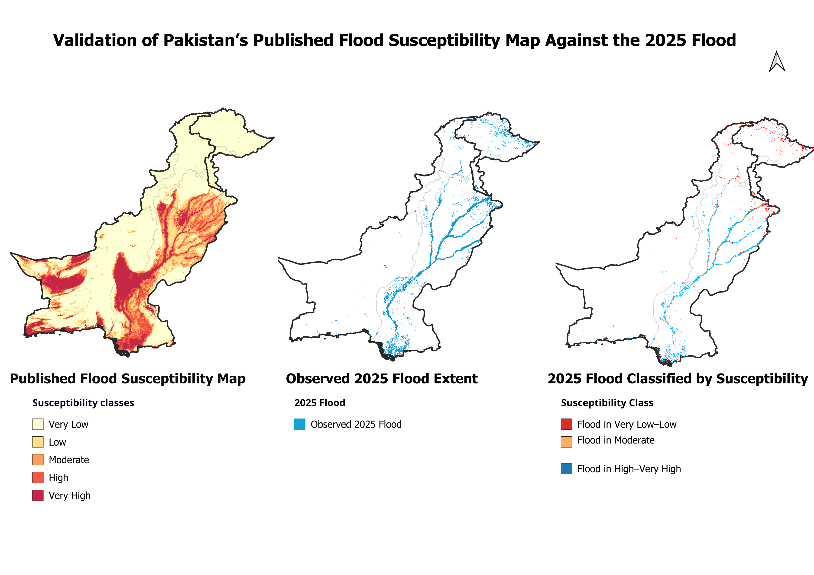
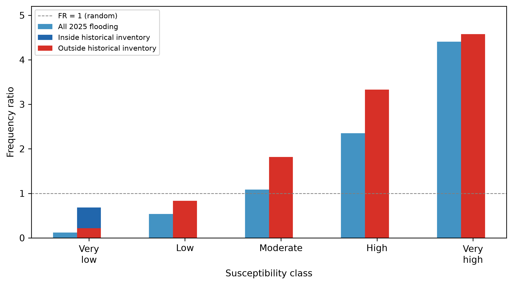
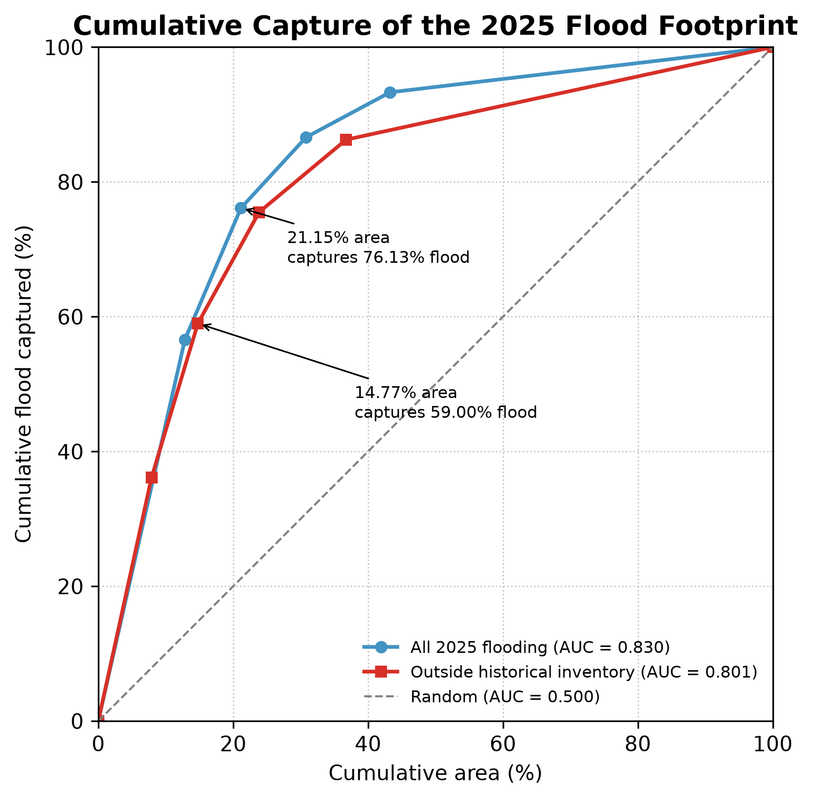

# Validation of Pakistan's Published Flood Susceptibility Map Using the 2025 Flood

## Overview
Testing a published 30 m machine-learning flood susceptibility map against the
unseen 2025 Pakistan flood event.

## Research question

Can a flood susceptibility model trained on 2010, 2014 and 2022 Pakistani floods
correctly identify areas affected by the 2025 flood,including locations outside
its historical flood inventory?
---
## Spatial Validation



**Figure 1.** Comparison of the published flood susceptibility map, satellite-observed 2025 flooding, and the susceptibility classes intersected by the observed flood footprint.
## Data

| Dataset | Role |
|---|---|
| Waleed & Sajjad (2025) LightGBM FSM | Published susceptibility map evaluated in this project |
| UNOSAT 2025 VIIRS flood extent | Independent flood observations |
| UNOSAT 2010, 2014 and 2022 flood products | Historical flood-inventory union |
| JRC Global Surface Water | Persistent-water exclusion (`occurrence > 75%`) |
| GADM level-1 boundaries | Regional / provincial analysis |

Large raw and intermediate geospatial files are intentionally excluded from this repository. The repository contains the processing code, result tables and figures needed to document the workflow.

## Methods

### 1. Valid analysis domain

The 2025 flood observations and supporting masks were aligned to the published
FSM grid. A cell was retained when it was:

- inside the UNOSAT analysis extent,
- not cloud-obstructed,
- not persistent surface water,
- and valid in the published FSM.

The resulting validation domain contained **1.248 billion aligned grid cells**,
including **23.79 million cells intersecting observed 2025 flooding**.

### 2. Frequency-ratio validation

For each susceptibility class:

`FR = (% of observed flood in class) / (% of valid area in class)`

- **FR > 1** → flooding is over-represented in that class.
- **FR < 1** → flooding is under-represented.



The analysis was repeated for:

1. the complete 2025 flood footprint,
2. areas overlapping the historical inventory, and
3. areas outside the historical inventory.

### 3. Historical-inventory generalization test

The historical flood mask was constructed as:

`2010 ∪ 2014 ∪ 2022`

The valid 2025 flood footprint was then divided into:

- **historical-inventory overlap**, and
- **historical-inventory non-overlap**.

This tests whether high susceptibility was associated with 2025 flooding even
outside locations represented by the historical flood inventories used during
development of the published map.

### 4. Cumulative flood capture

Susceptibility classes were ranked from:

`Very High → High → Moderate → Low → Very Low`

The cumulative proportion of observed flooding captured was plotted against
the cumulative proportion of available area.



The capture-curve AUC was:

- **0.830** for the full validation domain
- **0.801** for historical-inventory non-overlap areas

These are **cumulative flood-capture AUCs**, not ROC-AUC values.

### 5. Regional analysis

Validation metrics were summarized by GADM level-1 administrative unit to
evaluate whether map performance was spatially consistent across Pakistan.

The strongest large-sample generalization result occurred in **Punjab**:
**33.5%** of its observed 2025 flooding occurred outside the historical
inventory, yet **68.2%** of that non-overlap flooding was still located in
High or Very High susceptibility classes.


## Key findings

- **High and Very High** susceptibility classes covered only **21.2%** of the
  valid analysis domain but contained **76.1%** of observed 2025 flooding.
- Frequency ratio increased monotonically from **0.12** in the Very Low class
  to **4.41** in the Very High class.
- **25.9%** of valid 2025 flooding occurred outside the combined
  2010/2014/2022 historical flood inventory.
- Within this historical-inventory non-overlap area, High and Very High
  susceptibility classes occupied only **14.8%** of available area but
  contained **59.0%** of observed flooding.
- The cumulative flood-capture AUC remained high at **0.801** outside the
  historical inventory, compared with **0.830** for the full validation domain.
- Regional performance varied substantially: High and Very High classes
  captured **76.0%** of flooding in Punjab and **87.4%** in Sindh, but
  correspondence was very weak in Gilgit-Baltistan and Azad Kashmir.

> **Important:** these values are areas under a cumulative flood-capture curve. They are **not ROC-AUC values** and should not be directly compared with the ROC-AUC reported during development of the original model.

---

### 4. Performance varied substantially by region

| Region | Share of ADM1-assigned 2025 flood (%) | High + Very High capture (%) | Flood outside historical inventory (%) | High + Very High capture outside inventory (%) |
|---|---:|---:|---:|---:|
| Punjab | **63.97** | **76.01** | **33.50** | **68.20** |
| Sindh | 28.18 | **87.39** | 4.75 | 48.02 |
| Khyber-Pakhtunkhwa | 3.66 | 50.60 | 20.53 | 1.35 |
| Balochistan | 1.85 | **86.52** | 5.57 | **72.32** |
| Gilgit-Baltistan | 1.53 | 0.09 | 99.94 | 0.09 |
| Azad Kashmir | 0.68 | 0.00 | 79.70 | 0.00 |

The FSM showed strong correspondence in the principal lowland flood-affected regions, particularly **Punjab**, while correspondence was substantially weaker in northern mountainous regions such as **Gilgit-Baltistan** and **Azad Kashmir**.

The ADM1 analysis assigned **23,516,819** valid flooded grid cells to administrative units, about **98.9%** of the national valid flooded grid cells.

---

## Methods

### Frequency ratio

For each susceptibility class, FR is the ratio between its share of observed flooding and its share of the valid analysis domain. The denominator is recalculated separately for the overall, historical-overlap and historical-non-overlap analyses.

### Cumulative flood capture

Susceptibility classes are ranked:

```text
Very High -> High -> Moderate -> Low -> Very Low
```

The curve plots cumulative share of the valid analysis domain against cumulative share of observed flood captured.

### Historical-inventory split

The historical inventory is the union of flood footprints associated with the events used in development of the published Pakistan FSM:

```text
2010 ∪ 2014 ∪ 2022
```

2025 flooding is then separated into:

- **historical-inventory overlap**
- **historical-inventory non-overlap**

This provides a spatial generalization test in addition to the out-of-time event validation.

---

## Repository Structure

```text
fsm-2025-validation/
├── src/
│   ├── 01_inspect.py
│   ├── 02_rasterize.py
│   ├── 02e_inspect_historical.py
│   ├── 02f_rasterize_historical.py
│   ├── 02g_verify_historical.py
│   ├── 03a_historical_overlap.py
│   ├── 03c_prediction_curve.py
│   ├── 03d_provincial_analysis.py
│   └── ...
├── outputs/
│   ├── figures/
│   │   ├── Figure_1_Validation.png
│   │   ├── figure2_frequency_ratio.png
│   │   └── figure3_prediction_curve.png
│   └── tables/
│       └── provincial_validation.csv
├── .gitignore
└── README.md
```

Raw and intermediate rasters are not versioned because of file size and data-distribution considerations.

---


---

## References

- Waleed, M., & Sajjad, M. (2025). *High-resolution flood susceptibility mapping and exposure assessment in Pakistan: An integrated artificial intelligence, machine learning and geospatial framework*. **International Journal of Disaster Risk Reduction, 121**, 105442. https://doi.org/10.1016/j.ijdrr.2025.105442
- Salau, O., & Quiring, S. M. (2026). *Modelling Urban Pluvial Flooding in Cincinnati, Ohio, Using Machine Learning*. **ISPRS International Journal of Geo-Information, 15**(4), 173. https://doi.org/10.3390/ijgi15040173
- United Nations Satellite Centre (UNOSAT). *Satellite detected water extents from 26 August to 7 September 2025 over Pakistan*, Product 4197. https://unosat.org/products/4197
- Waleed & Sajjad Pakistan FSM data repository: https://zenodo.org/records/18513602

---


